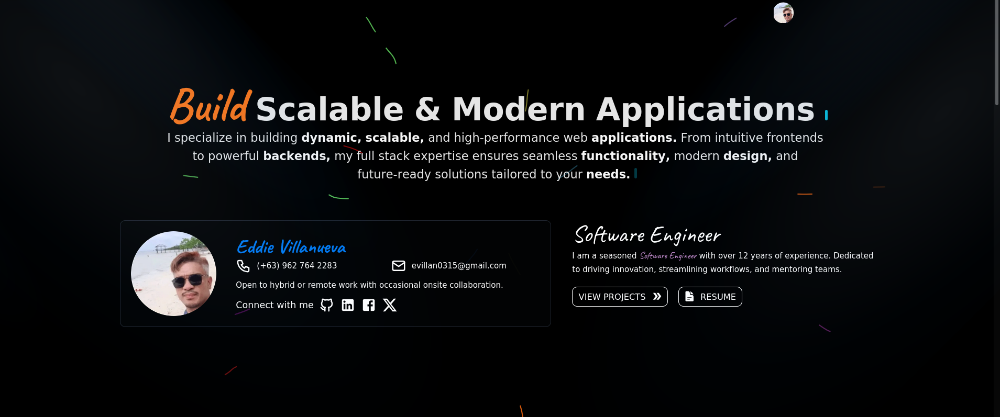

# Portfolio Website



A personal portfolio showcasing skills, projects, and a simple project management dashboard. Built with modern web technologies and deployed for a seamless, professional experience.

## 🚀 Project Overview

This project highlights my skills as a developer, featuring:

- **Custom Portfolio Design**: Professional layout built with **ReactJS**, **NextJS**, **TailwindCSS**, and **Material-UI**.
- **Project Management Dashboard**: Add and update projects using a user-friendly form.
- **Authentication**: Secure login via **Google** and **GitHub** using **NextAuth**.
- **Responsive Design**: Mobile-friendly for an optimal user experience.

[Visit the live website](https://eddie-porfolio.vercel.app)  
[View the source code](https://github.com/evillan0315/eddie-portfolio-v2)

---

## 📅 Development Timeline

- **Start Date**: October 1, 2024
- **End Date**: December 1, 2024

---

## 🔧 Features and Technologies

### Frontend

- **Technologies**: ReactJS, NextJS, TailwindCSS, Material-UI
- **Features**:
  - Custom theme and layout designed for a professional portfolio.
  - Simple project management form for adding and updating projects.
  - Mobile-responsive design for seamless user experience.

### Backend

- **Technologies**: Prisma, NextAuth, OAuth, GoogleLogin, GithubLogin
- **Features**:
  - API to handle form submissions and email notifications.
  - Authentication with secure session storage.
  - Integration of Google and GitHub login options.

### Database

- **Technologies**: MongoDB, PostgreSQL
- **Features**:
  - Stores project details and form submissions.
  - Manages user credentials and session data securely.

### API

- **Technologies**: REST, NodeMailer, Prisma
- **Features**:
  - REST API for handling form submissions and sending email notifications.
  - NodeMailer integration for automated email responses.

### Deployment

- **Technologies**: Vercel, GitHub Actions
- **Features**:
  - Deployed on Vercel for fast, serverless hosting.
  - Continuous deployment enabled with GitHub Actions.

---

## 🖥️ Installation and Setup

1. Clone the repository:

   ```bash
   git clone https://github.com/evillan0315/eddie-portfolio-v2.git
   cd eddie-portfolio-v2
   ```

2. Install dependencies:

   ```bash
   npm install
   ```

3. Create a `.env` file in the root directory and configure the following environment variables:

   ```
   NEXTAUTH_SECRET=your_secret_key
   DATABASE_URL=your_database_connection_url
   GITHUB_ID=your_github_client_id
   GITHUB_SECRET=your_github_client_secret
   GOOGLE_CLIENT_ID=your_google_client_id
   GOOGLE_CLIENT_SECRET=your_google_client_secret
   ```

4. Start the development server:

   ```bash
   npm run dev
   ```

5. Open your browser and navigate to `http://localhost:3000`.

---

## 📚 Lessons Learned

- Implementing OAuth authentication with NextAuth for Google and GitHub logins.
- Designing a responsive, professional-grade user interface with Material-UI and TailwindCSS.
- Deploying projects with Vercel and automating updates via GitHub Actions.

---

## 🌟 Acknowledgments

- [ReactJS](https://reactjs.org/)
- [NextJS](https://nextjs.org/)
- [TailwindCSS](https://tailwindcss.com/)
- [Material-UI](https://mui.com/)
- [Prisma](https://www.prisma.io/)
- [NextAuth](https://next-auth.js.org/)
- [MongoDB](https://www.mongodb.com/)
- [PostgreSQL](https://www.postgresql.org/)
- [Vercel](https://vercel.com/)
- [GitHub Actions](https://github.com/features/actions)

---

## 📞 Contact

If you have any questions or suggestions, feel free to reach out:

- **Portfolio**: [eddie-porfolio.vercel.app](https://eddie-porfolio.vercel.app)
- **GitHub**: [evillan0315](https://github.com/evillan0315)

---

### 🔖 License

This project is open-source and available under the [MIT License](LICENSE).

### Features of this README:

1. **Project Overview:** Provides a concise introduction.
2. **Timeline Section:** Highlights the start and end dates.
3. **Detailed Technology Breakdown:** Organized into frontend, backend, database, API, and deployment.
4. **Setup Instructions:** Clear steps to clone, configure, and run the project.
5. **Lessons Learned Section:** Personalizes the README.
6. **Acknowledgments:** Credits the tools and libraries used.
7. **Contact Information:** Makes it easy for others to reach you.

Feel free to tweak the content as necessary!
