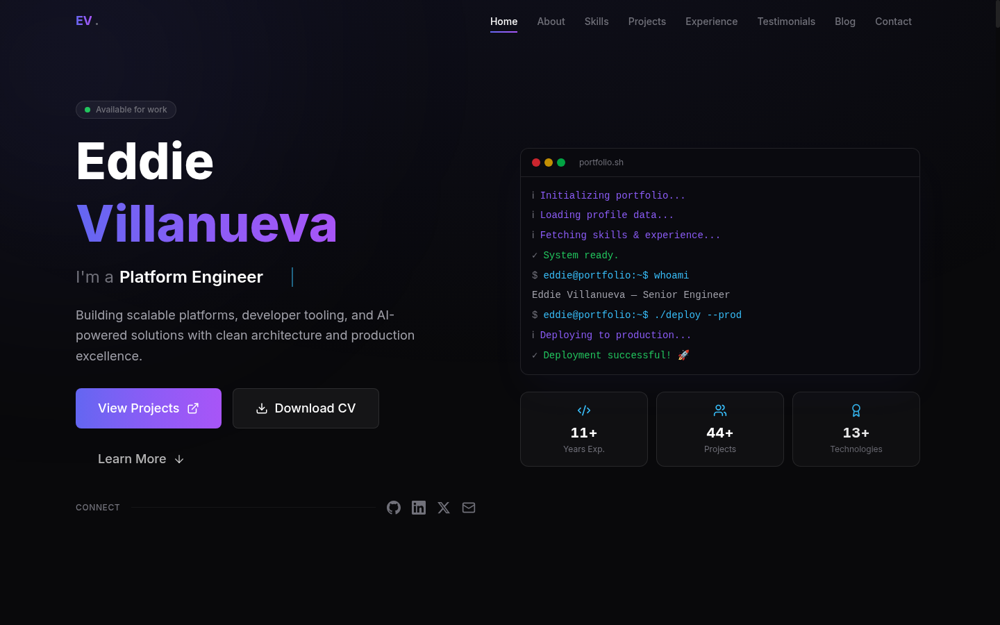

# Eddie Villanueva — Portfolio

<p align="center">
  
</p>

<p align="center">
  <strong>Full-Stack Engineer · Cloud Engineer · DevOps Engineer · AI Engineer</strong>
</p>

<p align="center">
  Building scalable platforms, developer tooling, and AI-powered solutions with clean architecture and production excellence.
</p>

<p align="center">


</p>

---

## Live Sites

| Site | URL |
|---|---|
| **GitHub Pages** | https://evillan0315.github.io/portfolio/ |
| **Vercel** | https://portfolio-xi-blush-65.vercel.app |

---

## Overview

A premium, SaaS-style personal portfolio showcasing expertise in full-stack engineering, cloud architecture, DevOps, and AI/LLM development. Designed as a high-end landing page with interactive elements, glassmorphism UI, and smooth animations — not a traditional resume site.

---

## Features

### Sections

- **Hero** — Typewriter role animation, interactive terminal window, floating stat cards, CTA buttons, social links, **Download CV button**
- **About** — Professional summary + 8 interactive engineering principle cards (Clean Architecture, SOLID, DDD, etc.)
- **Skills** — Tab-switcher between 11 Engineering Skill categories (with proficiency bars) and 6 AI & LLM Expertise categories
- **Projects** — 47 auto-populated GitHub repositories with tag filtering, featured badges, metrics, and GitHub/demo links
- **Experience** — Animated vertical timeline with 13 roles spanning 2005–Present
- **Testimonials** — Carousel with LinkedIn recommendations, star ratings, and navigation
- **Blog** — Card grid with tag filtering, reading time, and date metadata

### Technical Highlights

- Premium glassmorphism design with backdrop blur and gradient system
- All content driven by typed data files — zero hardcoded content in JSX
- Framer Motion animations (60 FPS, respects `prefers-reduced-motion`)
- Sticky glass navbar with scroll-spy and animated active indicator
- Mobile-responsive with animated drawer navigation
- SEO-optimized with Helmet, Open Graph, Twitter Cards, and JSON-LD structured data
- WCAG AA accessible with semantic HTML, ARIA labels, keyboard navigation, and focus indicators
- Auto-deployed via GitHub Actions to GitHub Pages on every push

---

## Technology Stack

### Frontend

| Library | Version |
|---|---|
| React | 19 |
| TypeScript | 5.8 (strict mode) |
| Vite | 8 |
| React Router | 7 |
| Tailwind CSS | 4 |
| Framer Motion | 12 |
| Lucide React | 0.510 |
| React Helmet Async | 2 |
| clsx + tailwind-merge | — |

### Tooling

| Tool | Purpose |
|---|---|
| oxlint | Linting |
| Prettier | Code formatting |
| pdfkit | Resume PDF generation |
| GitHub Actions | CI/CD & deployment |

---

## Project Structure

```
src/
├── components/
│   ├── layout/        # Navbar, Footer, RootLayout
│   ├── sections/      # Hero, About, Skills, Projects, Experience, Testimonials, Blog
│   └── ui/            # Button, GlassCard, Card, GradientText, SectionHeader, Badge,
│                      # AnimatedCounter, TerminalWindow, GlowBackground
├── data/              # Typed content files (profile, skills, projects, experience, etc.)
├── hooks/             # Custom React hooks
├── lib/               # Utility: cn() class merging
├── pages/             # HomePage, NotFoundPage
├── routes/            # React Router configuration
├── scripts/           # Build tooling (generate-resume.mjs)
├── styles/            # Global CSS with Tailwind `@theme` design tokens
├── types/             # Shared TypeScript interfaces
├── App.tsx            # Root component (HelmetProvider + RouterProvider)
└── main.tsx           # Entry point
public/                # Static assets (resume.pdf, favicon.svg, robots.txt)
```

---

## Design Tokens

| Token | Value |
|---|---|
| `--bg-primary` | `#09090B` |
| `--bg-secondary` | `#111118` |
| `--surface` | `rgba(255,255,255,0.05)` |
| `--glass-border` | `rgba(255,255,255,0.10)` |
| `--gradient-primary` | `#6366F1 → #8B5CF6 → #A855F7` |
| `--accent` | `#38BDF8` |
| `--text-primary` | `#FFFFFF` |
| `--text-secondary` | `#A1A1AA` |
| `--text-muted` | `#71717A` |

Typography: **Inter** — Hero: 72px+ · Section title: 48px · Subtitle: 24px · Body: 18px · Small: 14px

---

## Getting Started

### Prerequisites

- [pnpm](https://pnpm.io/) (v11+)

### Install & Run

```bash
git clone https://github.com/evillan0315/portfolio.git
cd portfolio
pnpm install
pnpm dev
```

### Available Scripts

| Command | Description |
|---|---|
| `pnpm dev` | Start development server |
| `pnpm build` | Production build (typecheck → Vite → copy 404.html) |
| `pnpm preview` | Preview production build |
| `pnpm lint` | Run oxlint |
| `pnpm typecheck` | Run TypeScript check |
| `pnpm format` | Run Prettier |
| `pnpm generate-resume` | Generate resume PDF from data files |

---

## Deployment

The portfolio is dual-deployed to **GitHub Pages** (via GitHub Actions) and **Vercel** (via Vercel CLI).

### GitHub Pages

The workflow in `.github/workflows/deploy.yml`:
1. Checks out the repository
2. Installs dependencies with pnpm
3. Runs `pnpm typecheck`
4. Runs `pnpm build`
5. Uploads `dist/` as a Pages artifact
6. Deploys to GitHub Pages

Vite `base` is set to `/portfolio/` (config uses `process.env.VERCEL` to switch between platforms).

### Vercel

Deployed via `vercel --prod`. Vite `base` is set to `/` on Vercel. Configured with `vercel.json` for SPA rewrites and security headers.

### SPA Support

`index.html` is copied to `404.html` at build time for GitHub Pages SPA fallback. Vercel uses a catch-all rewrite in `vercel.json`.

---

## Performance Targets

| Metric | Target |
|---|---|
| Performance | ≥95 |
| Accessibility | 100 |
| SEO | 100 |
| Best Practices | 100 |

---

## Accessibility

WCAG AA compliant:
- Semantic HTML throughout
- ARIA labels on all interactive elements
- Keyboard-navigable with visible focus indicators
- `prefers-reduced-motion` respected — all animations disabled
- Sufficient color contrast ratios

---

## Connect

- **Portfolio (GitHub Pages):** https://evillan0315.github.io/portfolio/
- **Portfolio (Vercel):** https://portfolio-xi-blush-65.vercel.app
- **Resume:** https://evillan0315.github.io/portfolio/resume.pdf
- **GitHub:** https://github.com/evillan0315
- **LinkedIn:** https://www.linkedin.com/in/evillanueva0315

---

## License

MIT © Eddie Villanueva
